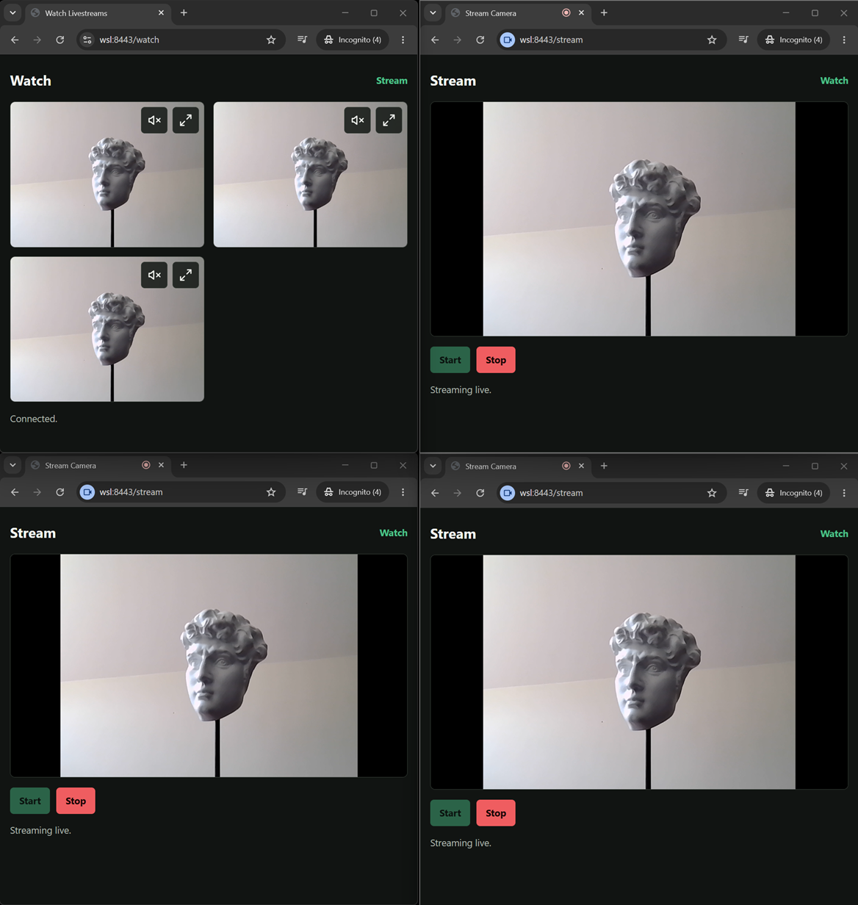

# Camera Livestream Demo

Camera Livestream Demo is a small FastAPI application for publishing and watching camera livestreams through a central server. Browsers can publish low-latency JPEG video streams over HTTP or WebSocket, or audio-enabled MediaRecorder chunks over WebSocket, while other browsers watch every active stream in real time. The app supports multiple publishers, late-joining viewers and camera switching.

The app has two mobile-friendly browser pages:

- `/stream`: opens the device camera, enables the microphone when the selected mode supports audio, shows a local preview, lets the user choose a streaming mode, and starts or stops publishing.
- `/watch`: shows all active livestreams in a responsive grid and updates automatically as streams start, reset, switch mode, or stop.

For implementation-specific design decisions and their rationale, see the [Architecture Decision Record](#adr-live-video-streaming-over-a-restricted-network).

## Functionality

- Supports three live streaming modes: MJPEG over HTTP, JPEG Frames over WebSocket, and MediaRecorder Chunks over WebSocket.
- Provides low-latency video-only streaming, optional audio-enabled streaming, and a lower-bandwidth encoded media path.
- Sends publisher media to the FastAPI server and relays it to all connected watchers through the selected HTTP(S) or WebSocket transport.
- Central-server-only routing: clients never connect directly to each other.
- Supports multiple active publishers at the same time.
- Lets mobile publishers swap between front and rear cameras when the browser and device support both.
- Lets publishers switch between streaming modes while keeping the same stream identity, so watchers keep the stream in the same grid position.
- Supports mixed stream types on the watch page, rendering each active stream with the appropriate browser playback mechanism.
- Uses native image rendering, JavaScript-updated image frames, or the browser `MediaSource` API depending on the active stream type.
- Connects new watchers to streams that were already live before the watcher opened `/watch`.
- Keeps mode-appropriate startup state so late-joining watchers can initialize playback for already-active streams.
- Sends stream lifecycle messages so watcher tiles appear, reset, and disappear without refreshing the page.
- Lets watchers mute/unmute streams with audio, expand a stream tile, and close the expanded view.
- Keeps watchers near the live edge by dropping stale image frames or trimming old buffered MediaRecorder data.
- Reconnects the watch page automatically if its WebSocket connection drops.

## Requirements

- Python 3.10 or newer for the server.
- A browser with support for `getUserMedia`, HTTP(S), WebSockets, image rendering, `MediaRecorder`, and `MediaSource`.
- Camera access is required for publishing video; microphone access is required when publishing audio-enabled streams.
- Most browsers require HTTP**S** for camera and microphone access for any host other than `localhost`.
- The network must allow clients to initiate HTTP(S) and WebSocket connections to the central FastAPI server.

## Setup

Use a virtual environment for this project. The examples below assume the venv is named `.venv` in the repository root.

Create and activate the virtual environment:

```bash
python3 -m venv .venv
source .venv/bin/activate
```

Then install the Python dependencies:

```bash
.venv/bin/python -m pip install -r requirements.txt
```

## Run

Localhost testing can use plain HTTP:

```bash
.venv/bin/python -m uvicorn app.main:app --host 0.0.0.0 --port 8000
```

For phones, tablets, or other intranet clients, browsers require a secure context for camera access. Run Uvicorn with an intranet-trusted certificate:

```bash
.venv/bin/python -m uvicorn app.main:app --host 0.0.0.0 --port 8443 --ssl-certfile cert.pem --ssl-keyfile key.pem
```

Then open:

- `https://SERVER:8443/stream`
- `https://SERVER:8443/watch`

All media flows client-to-server and then server-to-client, through the central FastAPI server using HTTP(S) and/or WSS, depending on the selected streaming mode.

## Tests

```bash
.venv/bin/python -m unittest discover -s tests
```

## Todo
- Implement the MJPEG over HTTP mode.
- Implement the JPEG Frames over WebSocket mode.

Currently only MediaRecorder Chunks over WebSocket mode is implemented. From the stream page, the user must be able to select the desired mode. When switching whilst a stream is active, the same stream id must be used, and on the watch page the same DOM (parent)element must be used, so that the same stream stays in at the same spot in the grid. There must also be a small overlay text on each stream which states the name of the stream mode being used.
## Screenshot



---

# ADR: Live Video Streaming over a Restricted Network

## Context

The application must support live streaming from devices and browsers within a highly restrictive network environment.

Network constraints:

- Clients cannot communicate directly with each other.
- Clients can only communicate with a central server.
- The server can not directly ping a client; only a client can initiate a request.
- The only protocols allowed on layer 7 of the OSI model (application layer) are HTTP(S) and WebSocket.
- Protocols such as RTSP, RTP, raw TCP/UDP, and peer-to-peer communication are not available.
- The solution must operate entirely through a central server.
- Low latency is an important requirement.

Several streaming approaches were evaluated:

### ❌ WebRTC

WebRTC is a browser-native technology for real-time audio, video, and data communication, typically optimized for direct peer-to-peer connections.

WebRTC is generally the preferred solution for low-latency audio/video streaming. However, it is not a good fit for the current environment because:

- Direct peer-to-peer communication is not possible.
- The application-layer protocol options are limited to HTTP(S) and WebSocket, but WebRTC uses SRTP over UDP.
- WebRTC would lose many of its advantages when all traffic must traverse a central server.

### ❌ HLS / LL-HLS

HLS and Low-Latency HLS are firewall-friendly and work well over HTTP-based networks. However, they are optimized for reliable media delivery at scale rather than ultra-low-latency communication.

Even with Low-Latency HLS, the stream is divided into media segments and partial segments that must be encoded, published, transferred, and buffered before playback can begin. This introduces significantly more latency than is acceptable for the primary use case, where the lowest possible end-to-end delay is a key requirement.

### ❌ RTSP / RTP

RTSP and RTP are widely used protocols for real-time video streaming and are commonly supported by cameras, encoders, and media servers.

However, these protocols are not permitted within the target network. The application layer only allows HTTP(S) and WebSocket communication between devices and the central server, making RTSP and RTP infeasible from a connectivity and deployment perspective. Adopting RTSP/RTP would require additional protocol gateways, proxies, or tunneling mechanisms, increasing architectural complexity while still not aligning with the network constraints.

### ✅ MJPEG over HTTP

MJPEG streams video as a sequence of standalone JPEG images inside a single long-lived multipart HTTP response:

```text
Content-Type: multipart/x-mixed-replace; boundary=frame

--frame
JPEG image

--frame
JPEG image
```

Each frame is independently encoded as a JPEG image. Frames are displayed sequentially. A browser can natively render an MJPEG stream directly with an image element:

```html

```

This makes classic MJPEG very simple for low-latency video-only streaming. It is allowed by the network constraints because it just uses HTTP(S).

Advantages:

- Very low latency.
- Simple implementation.
- Native browser rendering through an image element.
- Individual frames can be displayed immediately.

Disadvantages:

- High bandwidth usage.
- No audio support.
- No video compression between frames.
- Unidirectional transport.
- Might require a separate, additional WebSocket-based connection alongside the multipart HTTP streaming channel, when the application also needs control messages, lifecycle events, or telemetry.

### ✅ JPEG Frames over WebSocket

Video frames are captured, encoded as standalone JPEG images, and transmitted individually as WebSocket messages. This is conceptually similar to MJPEG because each frame is an independently encoded JPEG and there is no inter-frame compression, but it is not technically MJPEG because it uses WebSocket rather than a multipart HTTP response. The browser receives those messages in JavaScript and updates the displayed image as frames arrive.

Advantages:

- Very low latency.
- Individual frames can be displayed immediately.
- A single WebSocket connection is sufficient for media, and when control messages, lifecycle events, or telemetry are needed, as they are in this demo and likely in most real-world use cases, the same connection model can support them without requiring a separate multipart HTTP streaming channel.

Disadvantages:

- High bandwidth usage.
- No audio support.
- No video compression between frames.
- Requires client-side JavaScript rendering instead of native `` MJPEG playback.

### ✅ MediaRecorder Chunks over WebSocket

Media is captured using the MediaRecorder API and transmitted as encoded video chunks over a WebSocket connection.

Advantages:

- Supports both video and audio.
- Significantly lower bandwidth usage than (M)JPEG streaming.
- Leverages browser-provided media encoders.

Disadvantages:

- Higher latency due to encoding and buffering.
- More complex playback pipeline.
- Latency characteristics depend on browser implementation.

## Decision

The application will support three streaming modes within the network constraints. The advised streaming mode depends on the functional requirements of the use case:

| Mode | Recommended when |
|------|------------------|
| MJPEG over HTTP | <ul><li>No JavaScript is preferred.</li><li>Low-latency is required.</li><li>Video-only streaming is sufficient.</li><li>No control channel is needed, or an additional WebSocket is acceptable.</li></ul> |
| JPEG Frames over WebSocket | <ul><li>Low-latency is required.</li><li>Video-only streaming is sufficient.</li><li>A single connection model is preferred for media and control.</li></ul> |
| MediaRecorder Chunks over WebSocket | <ul><li>Audio support is required.</li><li>Lower bandwidth usage is preferred.</li><li>Higher latency is acceptable.</li></ul> |


## Architecture

### Mode 1: MJPEG over HTTP
```text
   Capture Device
          ↓
     JPEG Frames
          ↓
HTTP multipart stream
          ↓
   Central Server
          ↓
HTTP multipart stream
          ↓
   Viewer ()
```

### Mode 2: JPEG Frames over WebSocket
```text
Capture Device
      ↓
 JPEG Frames
      ↓
  WebSocket
      ↓
Central Server
      ↓
  WebSocket
      ↓
Viewer ()
```

Important note since this approach is not a native video/streaming format: the server should maintain a latest-frame-only strategy and drop outdated frames when necessary to minimize latency.

### Mode 3: MediaRecorder Chunks over WebSocket
```text
   Capture Device
         ↓
MediaRecorder Chunks
         ↓
     WebSocket
         ↓
   Central Server
         ↓
     WebSocket
         ↓
  Viewer (<video>)
```
